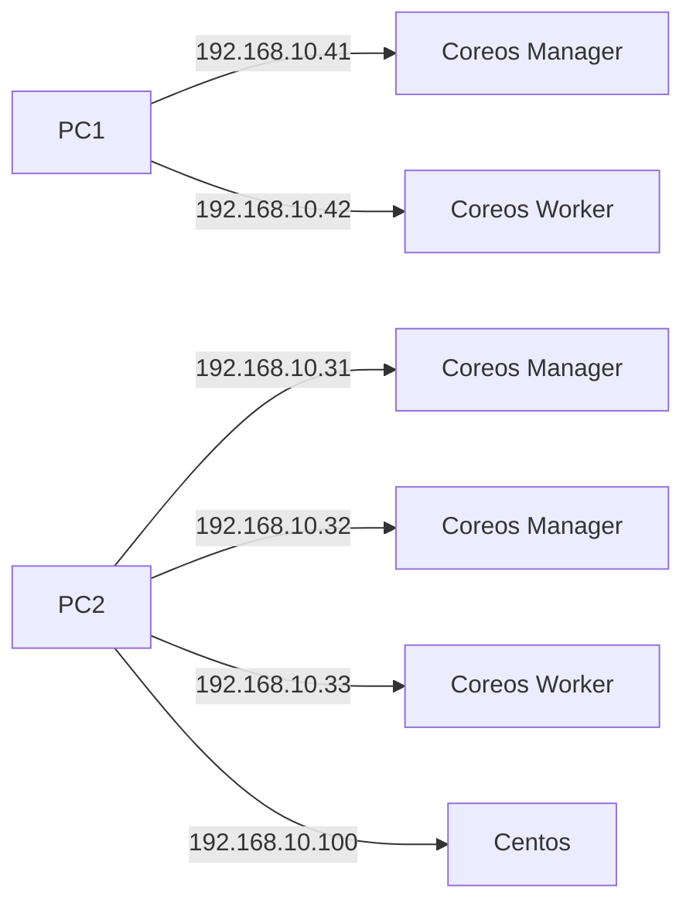

# TP Cloud:

## Notre infra :
2 Ordinateurs physiques avec 6 machines virtuelles :
* 2 machines virtuelles Coreos dont 1 manager et 1 worker sur un premier ordi physique
* 3 machines virtuelles Coreos dont 2 manager et 1 worker sur le second ordi physique
* Et enfin 1 machine virtuelle Centos pour le NFS sur le second ordinateur

>Le réseau utilisé pour le TP est 192.168.10.0/24 
>Adresse IP PC1 : 192.168.10.21
>Adresse IP PC2 : 192.168.10.20


# Configuration du Vagrantfile :

## Changement de la variable pour 5 machines
	$num_instances = 5
En modifiant cette variable, lors du lancement du Vagrantfile, 5 machines virtuelles vont se monter.

## Ajout du second disque
Pour ajouter un disque dur de 10Go lors de la création de la vm il faut ajouter ces lignes. 

      disk = "./disk/data#{i}.vdi"
      if !File.exist?(disk)
        vb.customize ['createhd', '--filename', disk, '--size', 10000, '--variant', 'Fixed']
        vb.customize ['modifyhd', disk, '--type', 'writethrough']
      end
      vb.customize ['storageattach', :id, '--storagectl', 'IDE Controller', '--port', 0, '--device', 1, '--type', 'hdd', '--medium', disk]
      end

Etant donné que l'on va lancer en tout 5 machines grâce au Vagranfile, il nous faut une variable pour pouvoir incrémenter le nom du disque dur, et les adresses IP, c'est la variable **i** que l'on va utiliser.

## Ajout d'une carte réseau en mode bridge

Pour donner une adresse IP à cette carte réseau, on va utiliser la variable **i** comme précédemment.

	ip = "192.168.10.#{i+40}"
	config.vm.network :public_network, :bridge => "Realtek USB GbE Family Controller", ip: ip

# Docker Swarm

## Mode expérimental

Pour activer le mode expérimental, ajouter ces 2 lignes dans le ficher *daemon.json* de Docker.

	{
	    "experimental": true,
	    "metrics-addr": "0.0.0.0:9323"
	}
## Ajout des Managers et Workers

**Initialiser un Manager**
````docker swarm init --advertise-addr 192.168.10.41 ````

**Faire d'une VM un manager** 
Taper dans un manager cette commande ```docker swarm join-token manager``` et suivre les indications.

**Faire d'une VM un worker**
Taper dans un manager cette commande ```docker swarm join-token worker``` et suivre les indications.

# REGISTRY SERVICE:

Il nous était trop long de récupérer les images sur tout les nœuds, nous avons donc monté un registre.
Pour créer un registre : ```docker service create --name registry --publish published=5000,target=5000 registry:2``` 

Vérifier que le registre fonctionne : ```curl 127.0.0.1:5000```. Le résultat doit être **{}**. Dans notre cas, la requête affichait bien les accolades vides.

Savoir où tourne le registre : ```docker service ps registry```

Lister les stacks:
docker stack ls

Lister les services d'un stack:
docker stack services "nom_de_l'appli"

Voir quelle application tourne sur quel conteneur et son état:
docker stack ps "nom_de_l'appli"

# Weave Cloud:

**Le principe** : Monitoring en temps réel pour nos 3 apps

Utiliser un conteneur *Docker Weave* :

	docker run -it --rm -v /var/run/docker.sock:/var/run/docker.sock weaveworks/swarm-agents install LE_TOKEN_DONNÉ_SUR_LE_SITE

# CEPH

Pour contourner le problème de password pour les copies de ceph, on est passé par l'appli web de nginx pour y mettre le dossier compressé tar.gz de ceph pour qu'on puisse le télécharger sur les autres machines :

```docker run -d -p 8081:80 -v $(pwd):/usr/share/nginx/html nginx``` *Pour lancer un conteneur web.*
```curl -SLO 192.168.10.41:8081/ceph.tar.gz``` *Récupérer le dossier*
```tar xvzf ceph.tar.gz``` *Permet de décompresser le dossier*
```sudo mkdir /etc/ceph```
```sudo cp etc/ceph/* /etc/ceph/```

>Petit soucis, pas assez de temps pour tout faire sur la partie **CEPH**, on a donc choisit de passer sur la partie NFS

# NFS

Etant donné que l'on a des choses à installer, on se place sur la machine **CentOS**. En effet, sur **CoreOS**, il n'y a pas d'équivalent correspondant à *yum install* ou *apt-get install*.
Par conséquent, il faudra veiller à ce que cette machine soit sur le même réseau que les autres et ait une carte qui puisse communiqué avec l'hôte (host-only)
>Adresse IP de la VM : 192.168.10.100 /24

On commence par installer nfs-utils : ```yum install -y nfs-utils```

Puis on lance et active les services NFS:

	systemctl enable nfs-server.service
	systemctl start nfs-server.service

Ensuite, on va créer un dossier partagé dans lequel on va stocker ce que l'on veut partager : ```mkdir /var/nfs```

Changement de propriétaire : ```chown nfsnobody:nfsnobody /var/nfs```

On met tous les droits sur le dossier : ```chmod 755 /var/nfs```

On va chercher à modifier le fichier exports pour définir les partages sur le réseau : ```vi /etc/exports``` pour y ajouter les lignes suivantes :

	/var/nfs        192.168.1.*(rw,sync,no_subtree_check)
	
Puis on on fait en sorte que les changements prennent effets : ```exportfs -a```

**À faire sur la machine CoreOS :**

On créé un dossier que l'on va utiliser, dans notre cas : ```mkdir -p /home/nfs```
Puis on monte le dossier que l'on vient de créer : ```mount 192.168.10.100:/var/nfs /home/nfs```

# KeepAlived

Lancer le conteneur :

	docker run -d --name keepalived --restart=always \
	  --cap-add=NET_ADMIN --net=host \
	  -e KEEPALIVED_VIRTUAL_IPS=192.168.10.200 \
	  -e KEEPALIVED_UNICAST_PEERS="#PYTHON2BASH:['192.168.10.31', '192.168.10.32', '192.168.10.33', '192.168.10.41', '192.168.10.42']" \
	  -e KEEPALIVED_PRIORITY=200 \
	  osixia/keepalived:1.3.5
